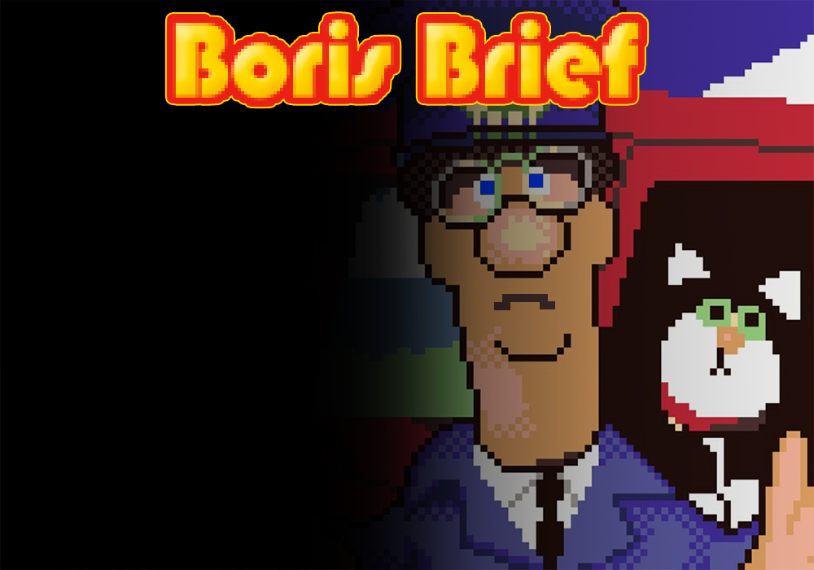

# Project Ingenieursbeleving 2 - Boris Brief

<h1>
    
</h1>

**Boris Brief** is een pseudo-3d game waar je als postbode pakjes rondbrengt naar tal van huisjes.

## Keybindings

### Movement

- Gebruik <kbd>&uparrow;</kbd>/<kbd>e</kbd>/<kbd>muis</kbd> om vooruit te gaan
- Gebruik <kbd>&downarrow;</kbd>/<kbd>d</kbd>/<kbd>muis</kbd> om achteruit te gaan
- Gebruik <kbd>&leftarrow;</kbd>/<kbd>s</kbd> om naar links te gaan 
- Gebruik <kbd>&rightarrow;</kbd>/<kbd>f</kbd> om naar rechts te gaan
- Gebruik <kbd>r</kbd>/<kbd>muis</kbd> om naar rechts te draaien
- Gebruik <kbd>z</kbd>/<kbd>muis</kbd> om naar links te draaien

### Others
- Gebruik <kbd>t</kbd> om in de auto te stappen (afstand < 1.5)
- Gebruik <kbd>y</kbd> om de auto in achteruit te zetten
- Gebruik <kbd>g</kbd> om deuren te openen (momenteel geen deuren meer in de game)
- Gebruik <kbd>space</kbd> om pakketjes af te vuren of de menu optie te selecteren
- Gebruik <kbd>m</kbd> om de volledige map te kunnen bekijken
- Gebruik <kbd>L SHIFT</kbd>/<kbd>L CTRL</kbd> om in en uit te zoomen op de map
- Gebruik <kbd>p</kbd> om de game te pauzeren en instellingen aan te passen

### Close game
- Gebruik <kbd>q</kbd> of <kbd>esc</kbd>

## Libraries
- sdl2
- Pillow
- ctypes
- configparser
- heapq
- Standard libraries: numpy,math

## Work in progress
- Sprites
- Fine tuning car
- Police car
- Multi-treading/-processing (done?)